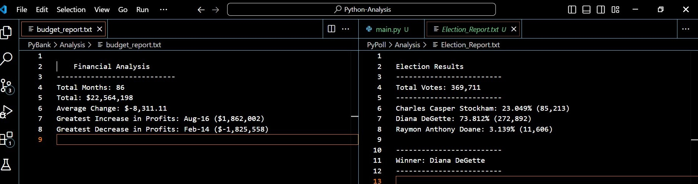

# Python Analysis

## Website: 
[website](https://github.com/Damiomo/Python-Analysis/tree/main)

## Description
There are two main.py scripts the provide a summary on stocks data and election polls.

## Table of Contents
- [Installation](#installation)
- [Usage](#usage)
- [Credits](#credits)
- [License](#license)
- [Features](#features)
- [Tests](#tests)
- [Contact](#contact)

## Installation
python

## Usage
run the two main.py files

## Credits
Damilare Omoboriowo

## License
MIT

## Features
It provides summaries of election and stuck data files

## Tests
confirm text reports are created.

## Contact
If there are any questions of concerns, I can be reached at:
##### [github: Damiomo](https://github.com/Damiomo)
##### [email: domoboriowo14@gmail.com](mailto:domoboriowo14@gmail.com)
